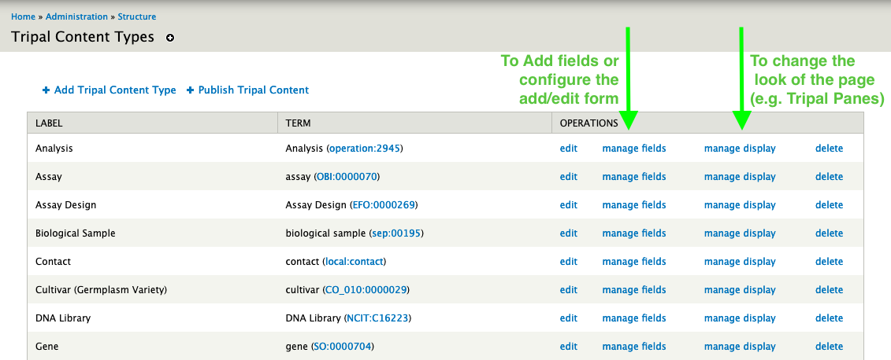

Page Configuration (Fields)
=============================

This module provides a large number of fields for displaying phenotypic data on various Tripal Content Pages. This guide is going to show you how to configure all of them to produce the following pages. However, every field is optional so pick and choose to your hearts content.

.. toctree::
   :maxdepth: 2
   :caption: Pages:

   fieldconfig/trait

Where is the Configuration?
-------------------------------

All of the following field configuration assumes you are on the "Manage Fields" or "Manage Display" pages for the tripal content type you are configuring. Specifically, this means that for Traits you would go to Administration » Structure » Tripal Content Types and then click on either the "Manage Fields" or "Manage Display" links on the same line as "Trait".

