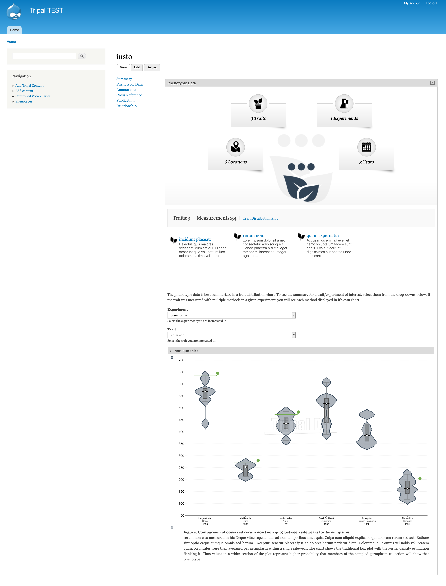
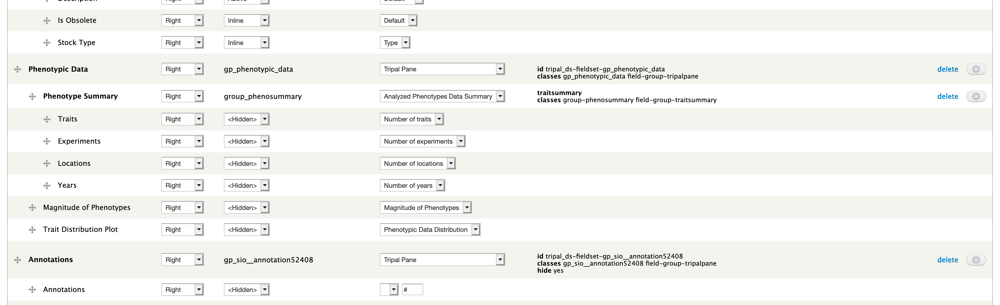

Germplasm Page
================

This configuration applies to any stock-based content type. For example, "cultivar" or "Germplasm Accession" are content types created by default Tripal using the Chado stock table for storage.

1. Create a Tripal pane to contain all phenotypic data fields.

2. Arrange the Phenotype summary

  - Create a new group of type "Analyzed Phenotypes Data Summary" to contain the summary statistics just as we did on the trait page.
  - Move all "Phenotype Summary" fields into this group.
  - Rename each "Phenotype Summary" field in the "Manage Fields" page to match what you would like as a label.
  - Move the group into the Phenotypic Data Tripal Pane

3. Move the "Magnitude of Phenotypes" field into the Phenotypic Data Tripal Pane, underneath the summary group but not nested within it. This provides a listing of traits that there is data for the current germplasm and gives an idea of the magnitude.

4. Move the "Trait Distribution plot" field beneath the "Magnitude of Phenotypes" field. Notice that the trait plot on germplasm pages has green lines showing where the germplasm falls within each site-year.

