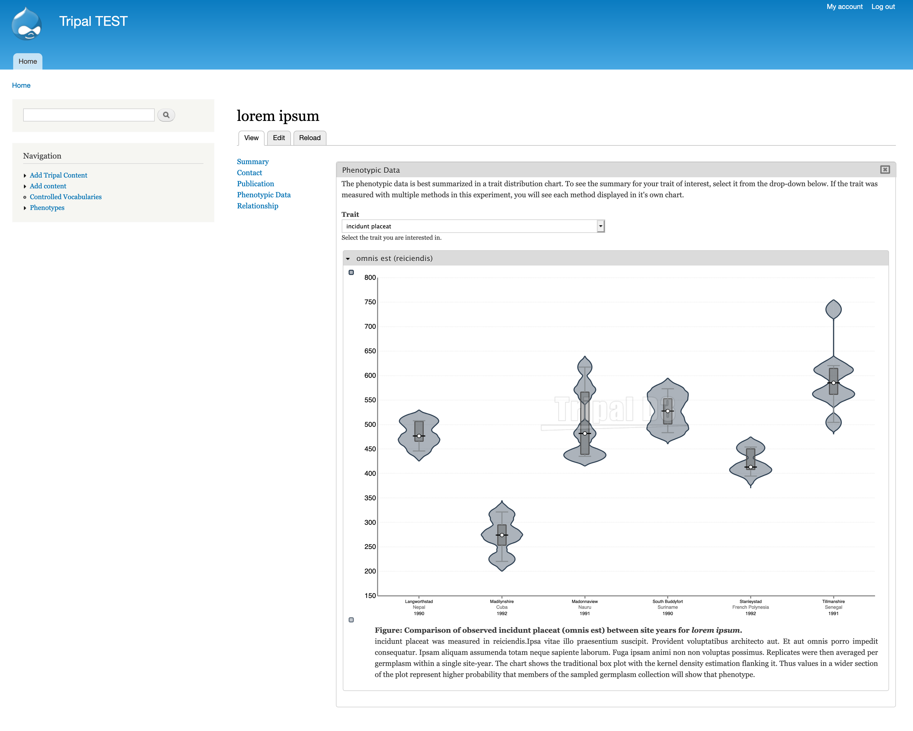
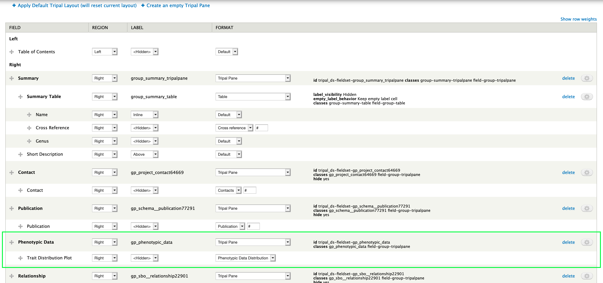

Project Page
================

This configuration applies to any project-based content type.

1. Create a Tripal pane to contain all phenotypic data fields.

2. Move the "Trait Distribution plot" field into the Phenotypic Data Tripal Pane.

