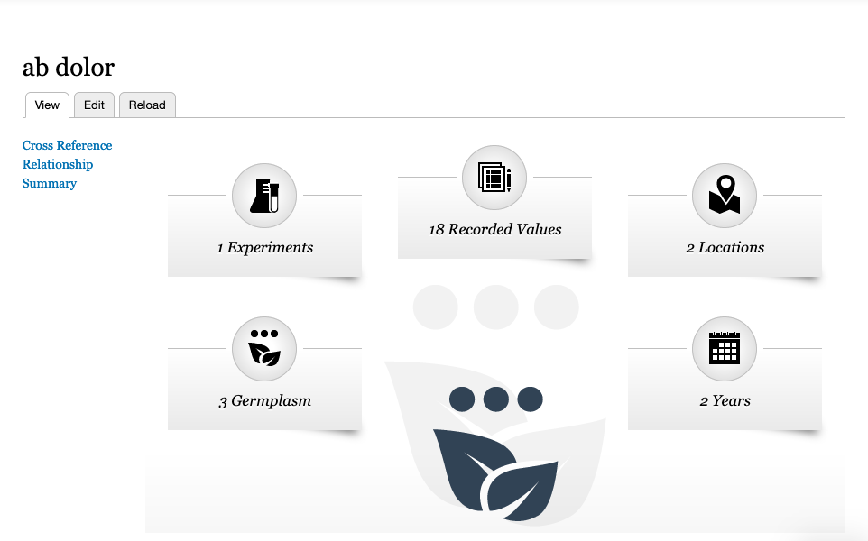
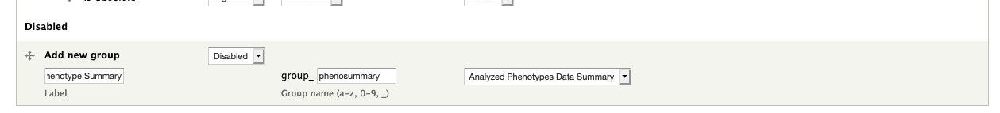
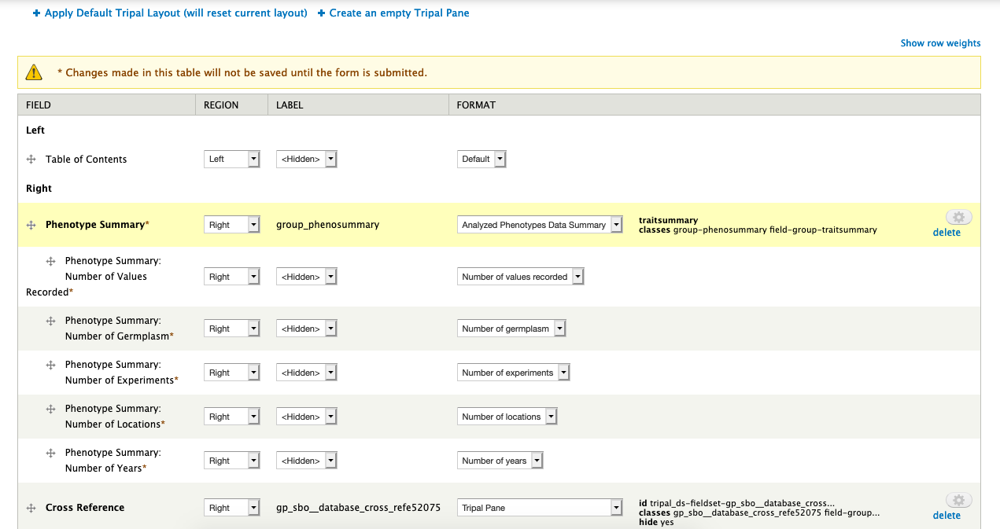
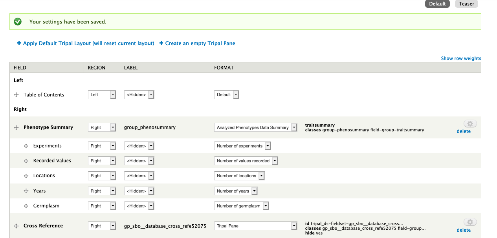

Trait Pages
=============

First off, we recommend installing ``tripal_ds`` and applying the default layout. This will unfortuantly pile all our new Analyzed Phenotypes fields into the summary table but it gives us a good place to start.

Phenotype Summary
-------------------

1. Go to "Manage Fields" and check that a series of "Phenotype Summary: Number of \*" fields are available. If not, click "Find new fields" and they should appear.

    - while not necessary, I suggest grouping these fields in order at the bottom of the page for better readability. These fields will not add widgets to your add/edit form.

2. Scroll to the bottom of the "Manage Display" page and add a new group named "Phenotype Summary" with a machine name of "phenosummary" and the type being "Analyzed Phenotypes Data Summary". Once filling it out click save to create it.

3. Arrange the new group near the top of the page. It can be within or outside a Tripal Pane based on your preference. Then arrange each "Phenotype Summary: Number of \*" nested underneath the group as shown in the following image. Click "Save" at the bottom of the page to save the order.

.. note::

  The order of the fields on this page controls the order of the numbers in the summary graphic.

4. Go back to the "Manage Fields" page and change the name of each "Phenotype Summary: Number of \*" field to be the label you would like displayed on the page. For example, you may change "Phenotype Summary: Number of Germplasm" to "Germplasm".

This will produce a summary at the top of your page!
