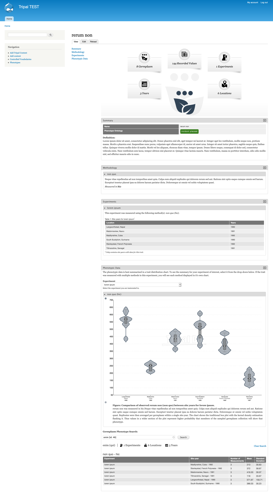
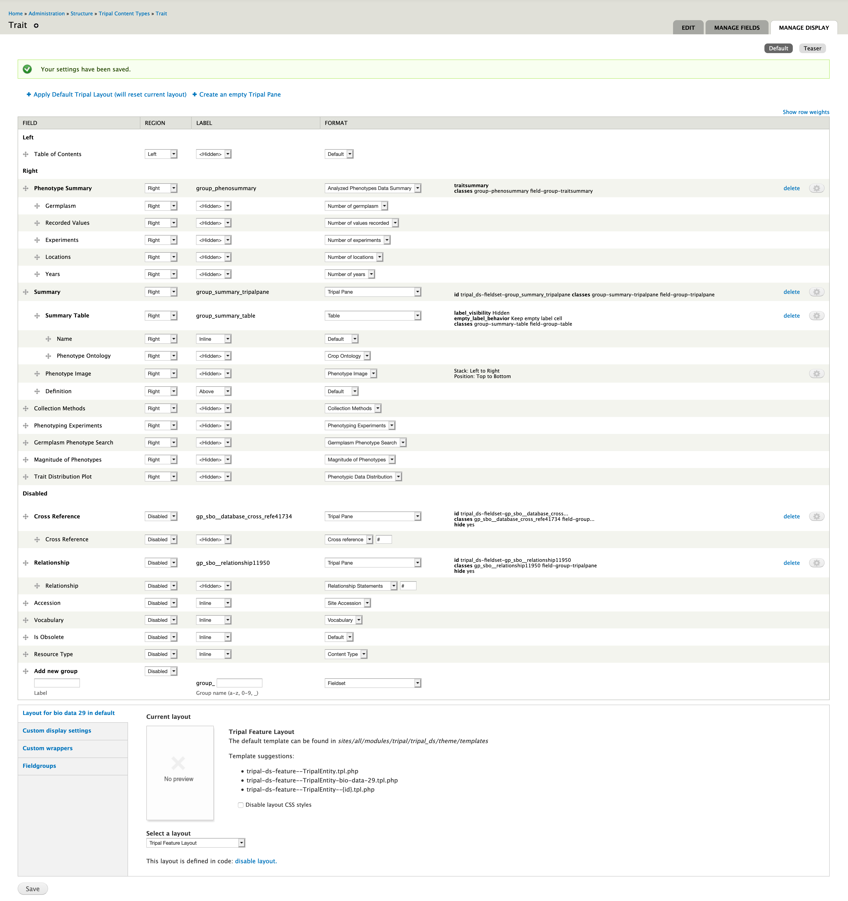
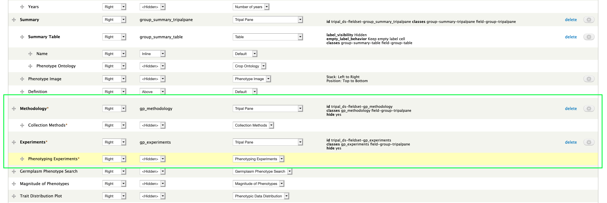
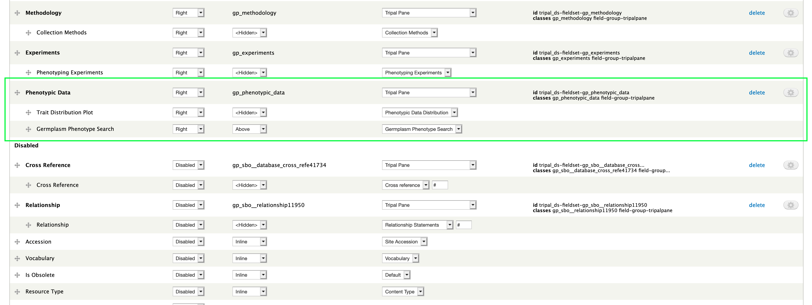

Trait Pages
=============

The following shows the full trait page configured on a default Tripal site with `Antonelli <https://www.drupal.org/project/antonelli>`_ theme and the following field configuration.

.. note::

  First off, we recommend installing ``tripal_ds`` and applying the default layout. This will unfortunately pile all our new Analyzed Phenotypes fields into the summary table but it gives us a good place to start.

Phenotype Summary
-------------------

.. image:: trait.display.png

1. Go to "Manage Fields" and check that a series of "Phenotype Summary: Number of \*" fields are available. If not, click "Find new fields" and they should appear.

    - while not necessary, I suggest grouping these fields in order at the bottom of the page for better readability. These fields will not add widgets to your add/edit form.

2. Scroll to the bottom of the "Manage Display" page and add a new group named "Phenotype Summary" with a machine name of "phenosummary" and the type being "Analyzed Phenotypes Data Summary". Once filling it out click save to create it.

.. image:: trait.1.png

3. Arrange the new group near the top of the page. It can be within or outside a Tripal Pane based on your preference. Then arrange each "Phenotype Summary: Number of \*" nested underneath the group as shown in the following image. Click "Save" at the bottom of the page to save the order.

.. image:: trait.2.png

.. note::

  The order of the fields on this page controls the order of the numbers in the summary graphic.

4. Go back to the "Manage Fields" page and change the name of each "Phenotype Summary: Number of \*" field to be the label you would like displayed on the page. For example, you may change "Phenotype Summary: Number of Germplasm" to "Germplasm".

.. image:: trait.3.png

This will produce a summary at the top of your page!

Core Trait Details
--------------------

This sections shows you which fields contain the core trait information such as definition, method and units.

.. warning::

  Remember to click save after each step!

1. Disable the following fields: Accession, Cross Reference, Relationship, Is Obsolete, Resource Type, and Vocabulary. The information provided by these fields is provided by the remaining fields in a more intuitive way.

2. Move the following fields out of the summary table (still in the summary): Phenotype Image and Definition.

3. Move the following fields out of the summary all together: Collection Methods, Phenotyping Experiments, Germplasm Phenotype Search, Magnitude of Phenotypes, Trait Distribution Plot.

4. Create a Tripal Pane for Collection Methods and another or Experiments by clicking "Create an empty Tripal Pane" at the top, entering the title and clicking save. Then nest the field within it.

.. note::

  If you do not want a Tripal Pane hidden on page load, click on the gear on the right hand side of the "Manage Display" for that Tripal Pane and uncheck the "Hide panel on page load" checkbox. Click both "update" and "save" and changing these settings.

Trait Distribution Plot
-------------------------

The trait distribution plot tool is also provided for embedding on trait pages via the ``Trait Distribution Plot`` field. We recommend placing this field in a Tripal Pane with the "Germplasm Phenotype Search" field beneath it.

