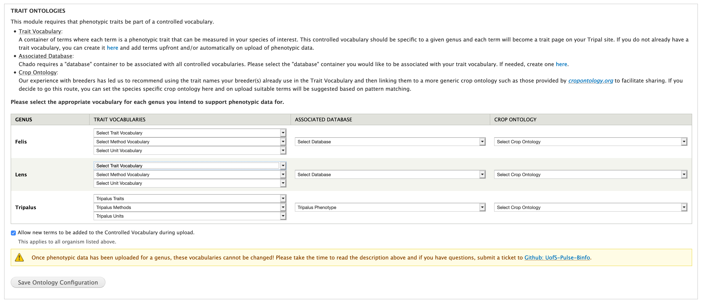
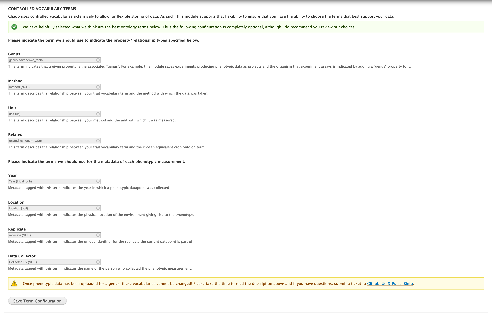

Set-up Ontologies
===================

Trait Ontologies
------------------

When collecting phenotypic data, it is very important to ensure you use the same methodology including units across replicates. If, for example, you were to measure plant height in inches one year and centimetres in another you would not be able to combine the data for analysis. The same is true if you stretch the plant to measure it's height in one location and in the next you do not. For this reason, this module attaches each measurement to
 - the trait it was measuring (e.g. plant height)
 - the method used to measure it (e.g. stretching the plant)
 - the unit it was measured with (e.g. centimetres)

The trait, method and unit are all stored as controlled vocabulary terms with each in it's own ontology. The Trait Ontologies fieldset in the Set-up Ontologies form allows you to set these ontologies (see configuration instructions below).

There are two schools of thought when it comes to storing phenotypic data:

1. Use published ontologies directly
2. Create custom controlled vocabularies which link to published ontologies.

This module supports both methodologies although it caters more to the second one. This is due to my experience working directly with both breeder's and researchers who are very particular in how traits are named. By using the same names they use, we ensure we are accurately capturing the trait which was measured and by linking that trait to the correct published ontologies (preferably with input from the data collector) we facilitate sharing of data. In my opinion this is the "best of both worlds" so to speak.

Method #1
^^^^^^^^^^^

1. Use the ontology loader available with Tripal (Admin > Tripal > Data Loaders > Chado Vocabularies > OBO Vocabulary Loader) to load an associated organism-specific ontology (e.g. http://www.cropontology.org/).

2. (OPTIONAL) Load a more generic trait ontology (e.g. http://www.obofoundry.org/ontology/to.html) to associate your traits with. This allows you to utilize two public ontologies with the link between them being specified by the trusted researcher loading the phenotypic data.

3. Configure each genus with the controlled vocabularies you loaded in step #1 and the database you created in step #3. To work with this module the controlled vocabulary must have three "namespace": one for trait, method and unit. If you loaded an additional public ontology (e.g. plant trait ontology), select it under "Crop Ontology".

4. Uncheck the "Allow new terms to be added to the Controlled Vocabulary during upload" checkbox to ensure new terms are not added to the public ontology during upload. Click the "Save Ontology Configuration" button.

Method #2 (Recommended)
^^^^^^^^^^^^^^^^^^^^^^^^^

1. Create a new controlled vocabulary for the following by using the "Add Vocabulary" form available at Admin > Tripal > Data Loaders > Chado Vocabularies > Manage Chado CVs. You will need one of the following for each genus you would like to manage phenotypic data for.

  - Trait (e.g. "Phenotypic Traits: Tripalus")
  - Method (e.g. "Phenotypic Methods: Tripalus")
  - Unit (e.g. "Phenotypic Units: Tripalus")

2. Create a new Database Reference container (i.e. chado.db) per genus by using the "Add Database" form available at Admin > Tripal > Data Loaders > Chado Databases. Chado requires database references for all controlled vocabulary terms; the one created here will be used for all three controlled vocabularies created in step #1. Leave the URL and URL prefix blank.

3. (OPTIONAL) Use the ontology loader available with Tripal (Admin > Tripal > Data Loaders > Chado Vocabularies > OBO Vocabulary Loader) to load an associated organism-specific ontology (e.g. http://www.cropontology.org/).

4. Configure each genus with the controlled vocabularies you created in step #1 and the database you created in step #3. If you loaded a genus-specific ontology, select it under "Crop Ontology". Click the "Save Ontology Configuration" button.

.. note::

  You can also configure whether you would like new controlled vocabulary terms to be added during upload of phenotypic data using the checkbox directly above the "Save Ontology Configuration" button. If you want to control the names of traits, I suggest un-clicking this checkbox and loading your trait dictionary using Admin > Tripal > Data Loaders > Phenotypic Trait Importer. If you do not have an admin with enough time or expertise to do this then I suggest leaving it checked and allowing traits to be created as needed.

Controlled Vocabulary Terms
-----------------------------

Chado uses controlled vocabularies extensively to allow for flexible storing of data. As such this module supports that flexibility to ensure that regardless of the types used for your data, this module will still be able to navigate the necessary relationships and interpret the data.

To provide ease of use, we have already chosen a set of controlled vocabulary terms and inserted them by default. This makes this portion of the set-up optional.

If you would like to change the above controlled vocabulary terms simply type the term you would like to use instead in the autocomplete box and then select it from the list. Once you have done this for all terms you would like to change, click the "Save Term Configuration" button.

.. warning:: Once you upload data, you can no longer change these terms.
