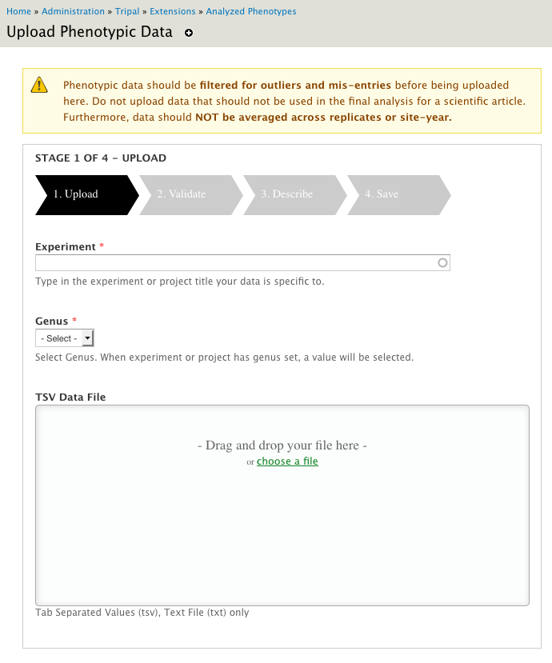
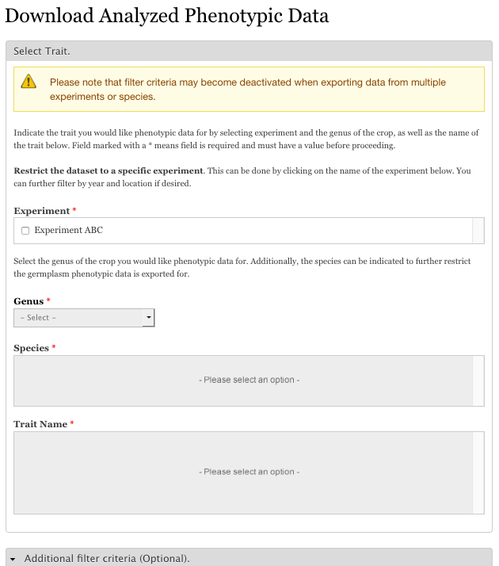
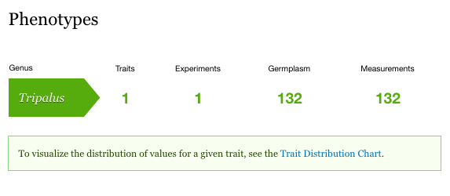
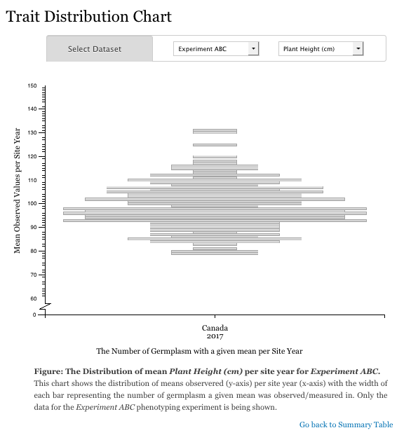

General Usage
=============

1. Configure this module by accessing Configuration page:
``[your site]/admin/tripal/extension/analyzedphenotypes/configuration``.

.. image:: usage.1.configuration-page.png

Figure 1. Configuration page.

2. Load or upload analyzed phenotypic data using the Upload page. To access upload page use the following link:
``[your site]/admin/tripal/extension/analyzedphenotypes/upload``.

Figure 2. Upload Page.

3. You can export a fullset or subset of data using data download page. To access download page use the following link:
``[your site]/phenotype/download``

Figure 3. Data Download Page.

4. Summary of analyzed phenotypic data and data visualization can be viewed using the following link
``[your site]/phenotypes``.

Figure 4: Summary Page and Trait Distribution Chart

