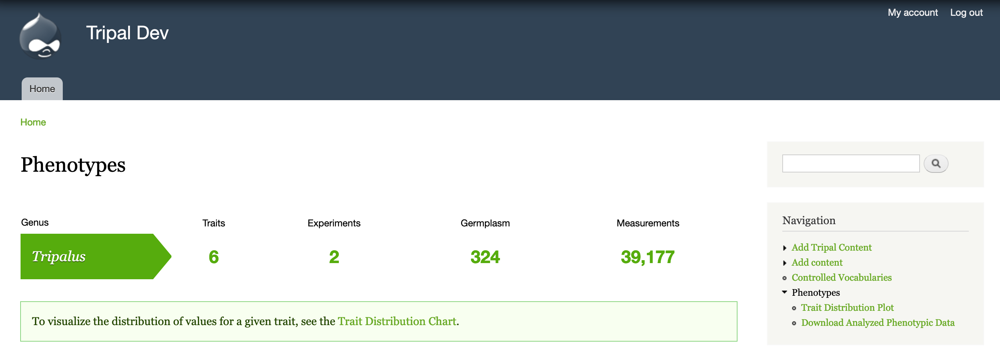
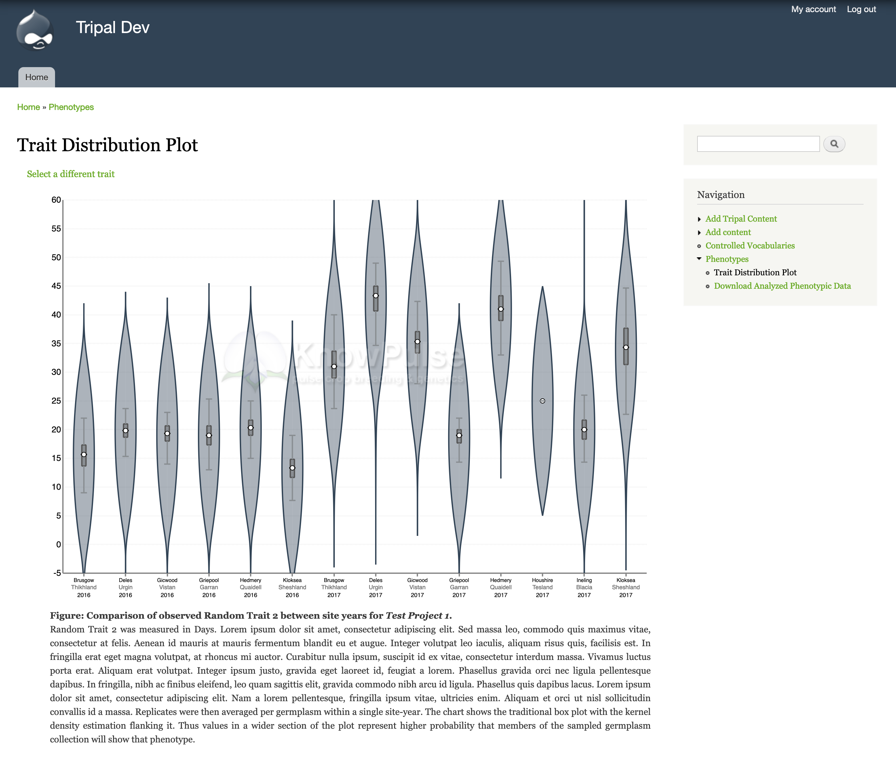

General Usage
=============

.. warning::

  Before you can use this module, you need to set it up the module by going to Admin > Tripal > Extensions> Analyzed Phenotypes > Set-up Ontologies. For more detail on how to do this, see the "Setup" documentation in the Administrators Guide.

Phenotypic data should be uploaded by trusted users, preferably the biologists who generated the data. This is done by going to Admin > Tripal > Extensions > Analyzed Phenotypes > Upload Phenotypic Data. Trusted users should be given permission to this page via Admin > People > Permissions and checking ``Upload Analyzed Phenotypic Data`` for the desired role. I suggest creating a Specific Role for users who will upload data and assigning users to that role via Admin > People.

Once you have phenotypic data uploaded, you should see it summarized at Navigation > Phenotypes (``https://[yoursite]/phenotypes``). This summary lets users know how many traits and experiments are available for a given genus. It also summarizes the number of germplasm assayed and the number of measurements stored to give an indication of magnitude.

Users can then see a summary of specific traits within a project through the **Trait Distribution Chart**. When you click on the link for the Trait Distribution chart at the bottom of the summary, you will be taken to a form where you choose the specific experiment, trait, method, unit combination you want to visualize. This level of granularity ensures that data in not combined when it is not statistically correct to do so. Also, quantitative data will be visualized with a `violin plot <https://mode.com/blog/violin-plot-examples>`_ and qualitative data will be visualized by a multi-series bar chart. Additionally, you can configure a watermark (shown in the screenshot below) for these charts to protect unpublished data.

Users can also download the data for further analysis. Currently, this module offers download of the data with replicates averaged. This protects the original filtered data while still facilitating genome-wide association studies. We suggest pairing this module with the `ND Genotypes module <https://github.com/uofs-pulse-binfo/nd_genotypes/>`_ to allow your users to easily download genotypic and phenotypic data associated with the same germplasm.
