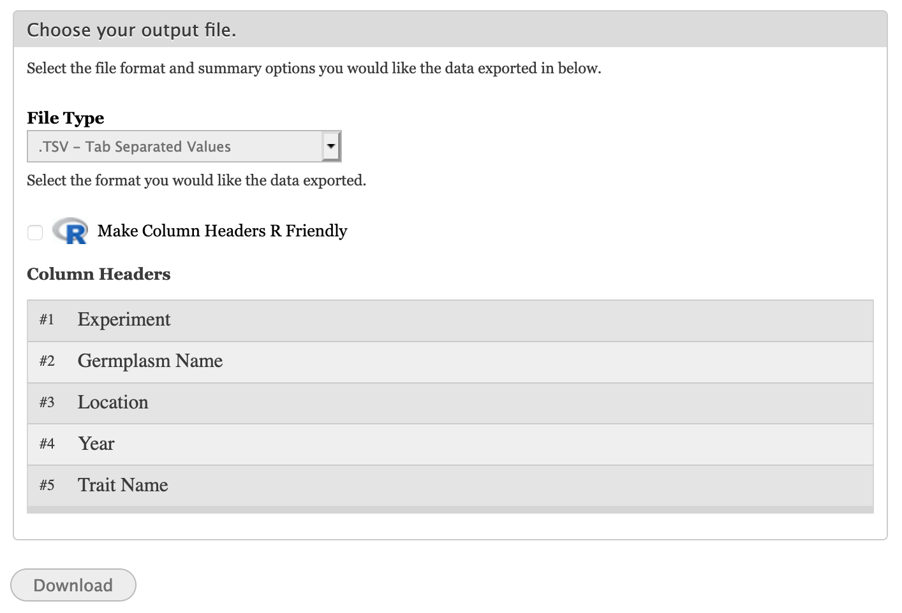

Downloading Phenotypic Data
=============================

Download data page is where user can download a subset of analyzed phenotypes data, as well as, the full set. Data generated in this page can be xlxs, tsv and csv file format.

To further filter data for desired set, additional filter options are available to user.

To organize result set, options are provided to ensure that exported data meet users requirements in terms of file format, header ordering and average values.

File is generated instantly based on the filter and format options selected by user.

