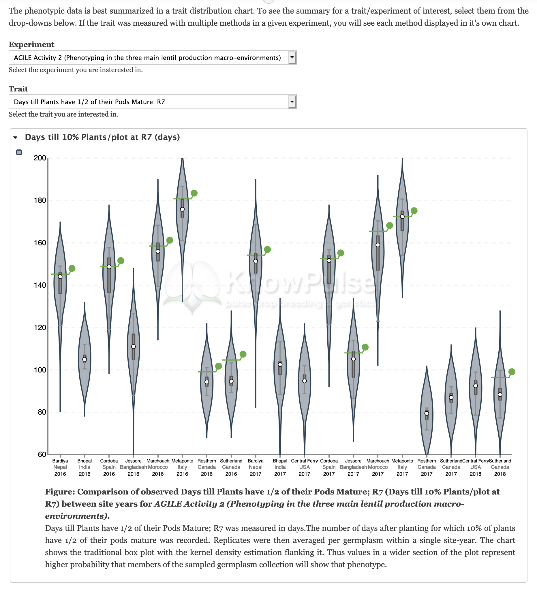
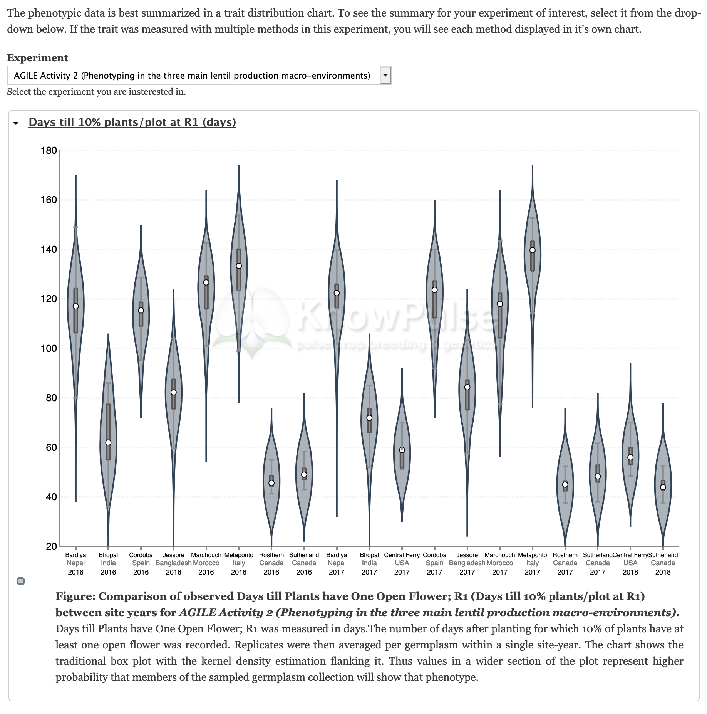
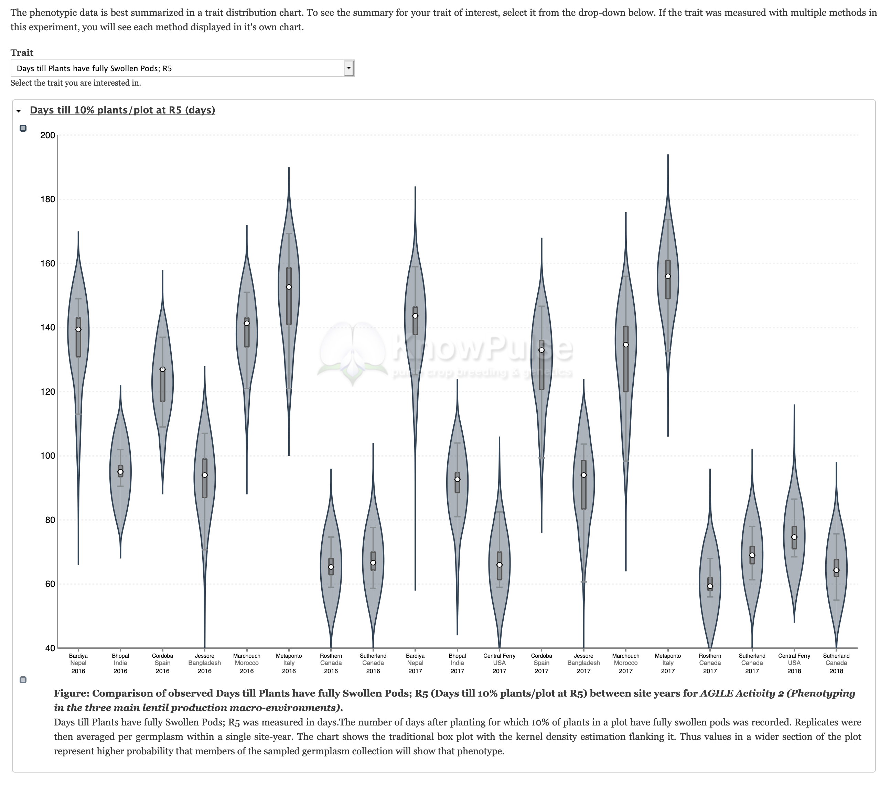
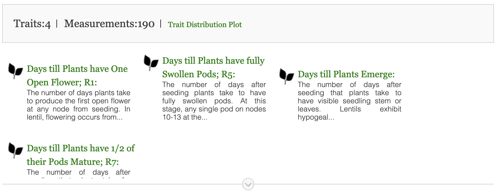
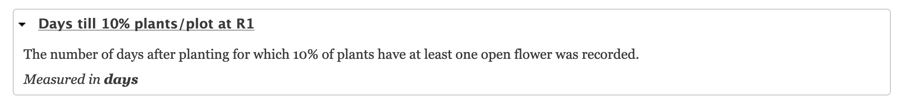
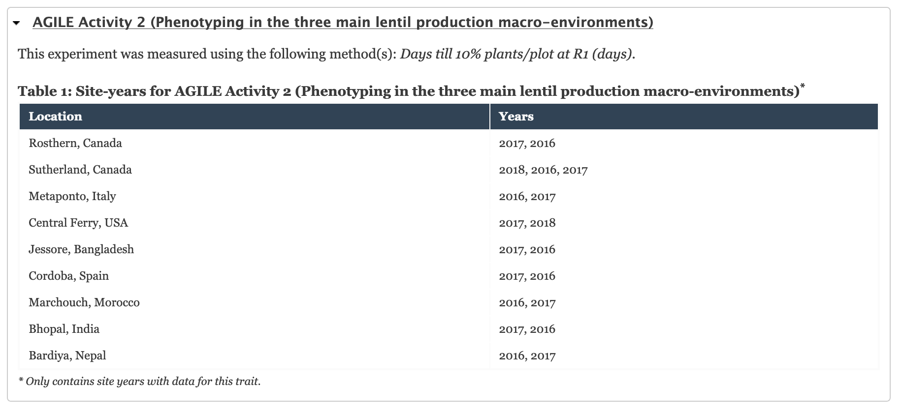

Tripal Fields
===============

This module offers a number of Tripal Fields for enhancing trait, project, and germplasm pages. Fields are available to content types with specific chado base tables as indicated below. In addition to the default Tripal content types listed, these fields will also be available to any custom content types based on the listed chado tables.

Trait Distribution Chart (hp__phenotypic_variability)
------------------------------------------------------

+------------------------------+-----------------------------------------------+
| Base Chado table             | project, stock, cvterm (traits)               |
+------------------------------+-----------------------------------------------+
| Default Tripal Content Types | Project, Study, Cultivar (germplasm Variety), |
|                              | Generated Germplasm (breeding Cross),         |
|                              | Germplasm Accession, Recombinant Inbred Line  |
+------------------------------+-----------------------------------------------+

In all cases, this field will embed the Trait Distribution Chart in your Tripal Content page. However, there is also specific forms and functionality depending on the content type it is attached to.

Germplasm
^^^^^^^^^^

On stock-based pages, the user can select an experiment (project) and a trait after which they will see the trait distribution plot specific to that combination. If the trait was measured using multiple methods (e.g. if the method changed through the project) then a chart per method will be shown. Additionally, the current germplasm is indicated in each site-year by a green line intersecting the violin. The user can hover-over the attached circular handle to see the exact value recorded for the current germplasm in a particular site-year.

Traits
^^^^^^^

On cvterm-based trait pages, the user can select the specific experiment  after which they will see the trait distribution plot for the current trait specific to the experiment chosen. If the trait was measured using multiple methods (e.g. if the method changed through the project) then a chart per method will be shown.

Project
^^^^^^^^

On project-based pages, the user can choose a trait to visualize after which they will see the trait distribution plot specific to the current project. If the trait was measured using multiple methods (e.g. if the method changed through the project) then a chart per method will be shown.

Magnitude of Phenotypes (local__magnitude_of_phenotypes)
---------------------------------------------------------

+------------------------------+-----------------------------------------------+
| Base Chado table             | stock                                         |
+------------------------------+-----------------------------------------------+
| Default Tripal Content Types | Cultivar (germplasm Variety),                 |
|                              | Generated Germplasm (breeding Cross),         |
|                              | Germplasm Accession, Recombinant Inbred Line  |
+------------------------------+-----------------------------------------------+

This field is meant to give an indication for how much phenotypic data is available for a given germplasm. It indicates the number of traits measured and the total number of phenotypic measurements collected, as well as linking to both the trait distribution chart and individual trait pages for more information. The first few traits are shown by default with an expandable arrow giving access to the rest.

Methodology (ncit__method)
---------------------------

+------------------------------+-----------------------------------------------+
| Base Chado table             | cvterm (traits)                               |
+------------------------------+-----------------------------------------------+
| Default Tripal Content Types | None available. Please create a content type  |
|                              | through the Administrative UI.                |
+------------------------------+-----------------------------------------------+

This field simply lists the methods used to measure a given trait. This is helpful for understanding the differences you may see between data from different experiments, as well as, to inform possible techniques for future experiments.

Experiments (sio__study)
-------------------------

+------------------------------+-----------------------------------------------+
| Base Chado table             | cvterm (traits)                               |
+------------------------------+-----------------------------------------------+
| Default Tripal Content Types | None available. Please create a content type  |
|                              | through the Administrative UI.                |
+------------------------------+-----------------------------------------------+

This field lists each experiment assaying the current trait. For each experiment the method used and site-years are listed.

