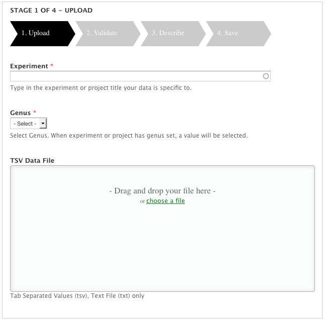
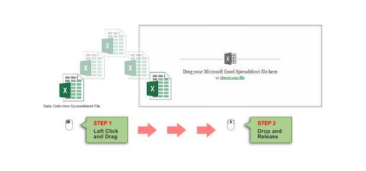
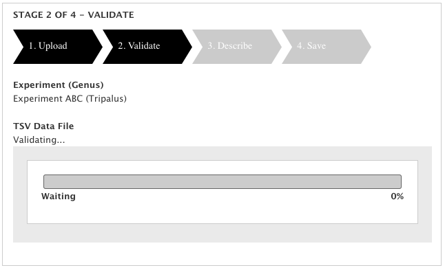
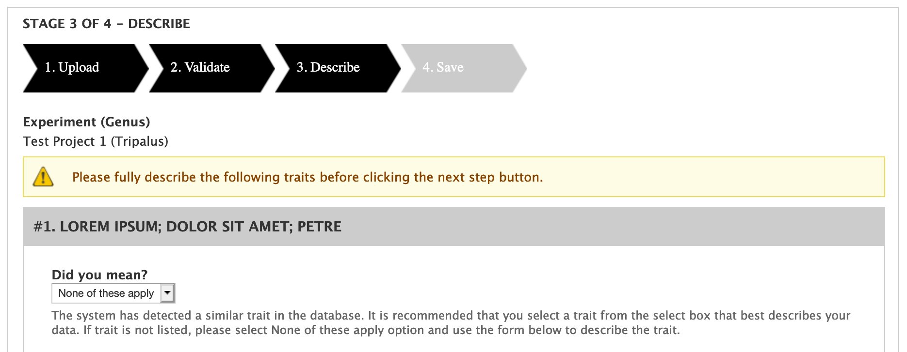
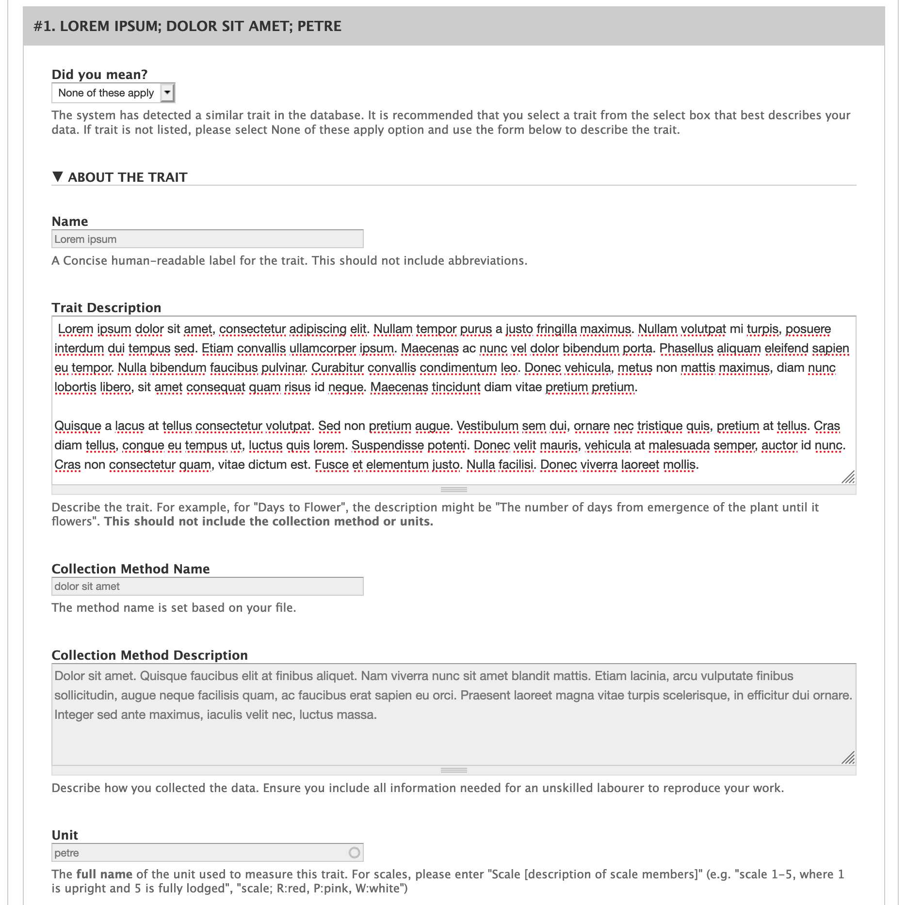
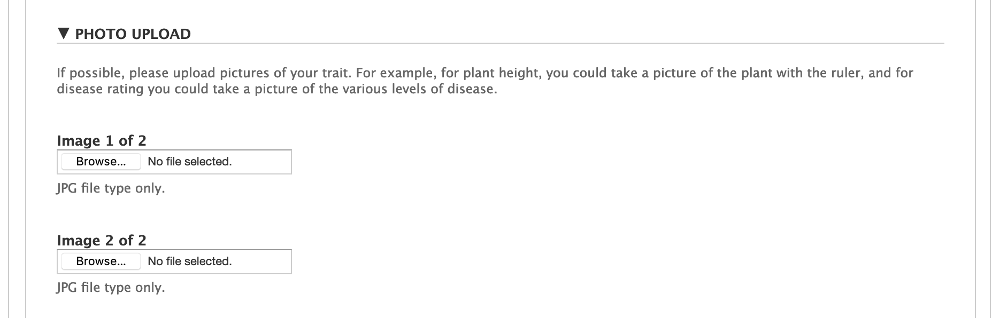
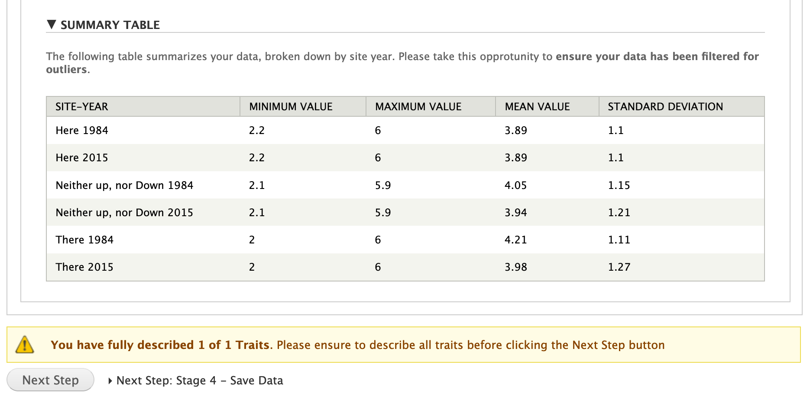
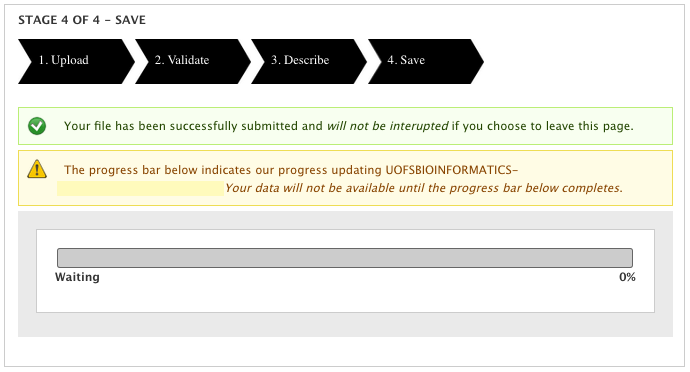

Uploading Phenotypic Data
==========================

Upload File Format
-------------------

The upload data page handles and processes analyzed phenotypic data provided in Tab-Delimited Values or .TSV format. This file is expected to contain the following columns:

- **Trait Name**: The full name of the trait as you would like it to appear on a trait page. This should not be abbreviated. (e.g. Days till one open flower)
- **Method Name**: A short (<4 words) name describing the method. This should uniquely identify the method while being very succinct. (e.g. 10% Plot at R1)
- **Unit**: The unit the trait was measured with. In the case of a scale this column should defined the scale. (e.g. days)
- **Germplasm Accession**: The stock.uniquename for the germplasm whose phenotype was measured. (e.g. ID:1234)
- **Germplasm Name**: The stock.name for the germplasm whose phenotype was measured. (e.g. Variety ABC)
- **Year**: The 4-digit year in which the measurement was taken. (e.g. 2020)
- **Location**: The full name of the location either using "location name, country" or GPS coordinates (e.g. Saskatoon, Canada)
- **Replicate**: The number for the replicate the current measurement is in. (e.g. 3)
- **Value**: The measured phenotypic value. (e.g. 34)
- **Data Collector**: The name of the person or organization which measured the phenotype.

The following is a short example:

.. code-block:: none

  Trait Name	Method Name	Unit	Germplasm Accession	Germplasm Name	Year	Location	Replicate	Value	Data Collector
  Lorem ipsum	dolor sit amet	metris	ID:1	GERM1	2015	"Neither up, nor Down"	1	5.3	Lacey Sanderson
  Lorem ipsum	dolor sit amet	metris	ID:2	GERM2	2015	"Neither up, nor Down"	1	2.2	Lacey Sanderson
  Lorem ipsum	dolor sit amet	metris	ID:3	GERM3	2015	"Neither up, nor Down"	1	4.9	Lacey Sanderson
  Lorem ipsum	dolor sit amet	metris	ID:1	GERM1	2015	There	1	5.1	Lacey Sanderson
  Lorem ipsum	dolor sit amet	metris	ID:2	GERM2	2015	There	1	3.6	Lacey Sanderson
  Lorem ipsum	dolor sit amet	metris	ID:3	GERM3	2015	There	1	4	Lacey Sanderson
  Lorem ipsum	dolor sit amet	metris	ID:1	GERM1	2015	Here	1	5.1	Lacey Sanderson
  Lorem ipsum	dolor sit amet	metris	ID:2	GERM2	2015	Here	1	3.3	Lacey Sanderson
  Lorem ipsum	dolor sit amet	metris	ID:3	GERM3	2015	Here	1	4.5	Lacey Sanderson

You can see a full example of this file distributed with the module: ``tests/example_files/AnalyzedPhenotypes-TestData-1trait3loc2yr3rep.txt``.

Stage 1: Upload File
----------------------

The trusted researcher enters the experiment they would like to associate phenotypic data with. This experiment must already exist. They then choose the genus of the germplasm phenotyped and upload the associated phenotypic data file. This upload page supports both "drag and drop" functionality as well as manual upload.

Basic compliance tests at the file level are performed to ensure that requirements outlined are met. For instance, the file must be a valid tab-delimited file following the format outlined above, the genus must be configured for phenotypic data and the experiment must be selected.

Stage 2: Validate File
------------------------

In this stage, the file undergoes a data level validation. The entire file is tested against a set of validation rules to ensure that the phenotypic data is compliant. The following is checked:
  - File complies with the format specified above
  - If "Allow new traits..." has been unchecked in configuration, ensure all traits already exist.
  - All columns have a value
  - All metadata columns have the correct data type (e.g. integer for replicates)
  - Each value matches the expected data type, based on the unit
  - All germplasm must already exist in the site and matches to the file must be exact
  - Trait, method, unit, germplasm, location, year, replicate combination must be unique in the file

While validation is ongoing, the user is presented with a friendly progress bar.

.. warning::
  Administrators are urged to setup the Tripal Daemon since validation occurs during a Tripal Job.

Once validation is complete, the trusted researcher is shown a list of green checkmarks detailing which criteria passed. If any criteria were not met, a red stop symbol will be shown with helpful information on how to fix the problem.

Stage 3: Describe Traits
--------------------------

Each unique trait in the file is described in this step.

If the trait already exists, the trusted researcher will be shown the trait name, method and unit details existing in the system. This allows them to confirm they have chosen the right values for their file. If the trait does not already exist and the system has been configured to allow entry of traits on upload, the trusted researcher will be asked to describe their trait, data collection method and units.

The trusted researcher also has the ability to upload images describing a trait. For example, an image showing the scale is particularly helpful!

Finally, the data in the file for a given trait is summarized. This can help the researcher pick out problems such as outliers with the data before they upload it. Furthermore, it can be used to confirm the correct file was uploaded.

Stage 4: Save Phenotypic Data
------------------------------

The original file i saved and phenotypic data is processed before being saved in the database. This step does not require any input from the trusted researcher and will not be interrupted if the researcher leaves the page before it is complete.

