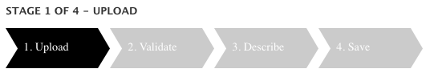
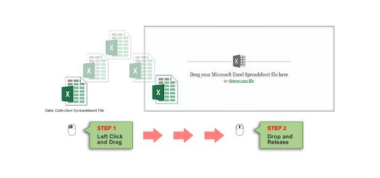
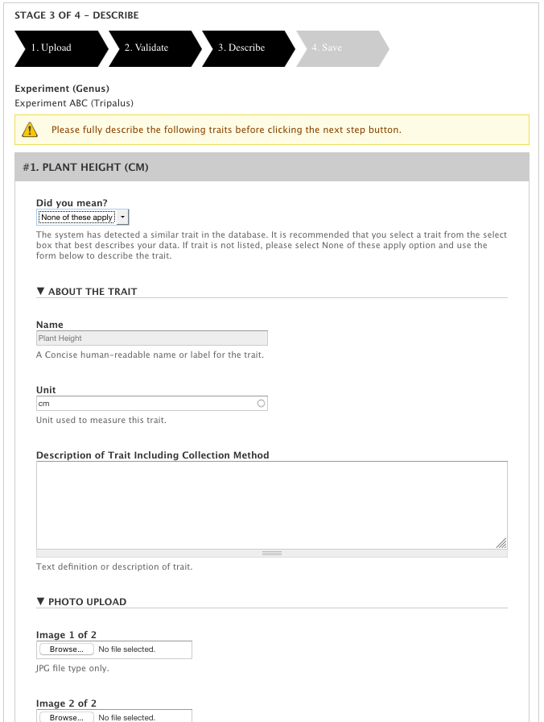
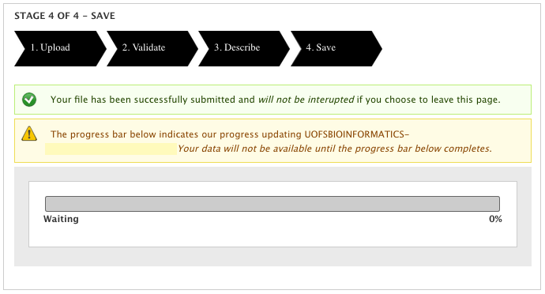

Uploading of Analyzed Phenotypic Data
=====================================

The upload data page handles and processes analyzed phenotypic data translated in the form of a Tabbed Delimited Values or .TSV file. The process is divided into 4 stages.

Figure 1: Stage Indicator in Upload Page.

Stage 1: Upload
----------------

Basic compliance tests on the file level are performed to ensure that requirements outlined are met. For instance, file must be a valid .tsv file and experiment has been selected.

.. image:: loading.2.stage-1.png

Figure 2: Upload Page Supports Drag and Drop File Upload, as well as Manual Upload.

Stage 2: Validate
------------------

In this stage, the file undergoes a data level validation where data in rows and columns are tested against a set of validation rules to ensure that a value meets a set of conditions and requirements.

.. image:: loading.4.stage-2.png

Figure 3: Validate Stage shows progress bar to show user the status of data validation process.

Stage 3: Describe
-----------------

The file is further examined for all the unique traits in the Trait Name column. Information is then requested from the user for each trait detected.

Figure 4: Describe Stage showing data form requesting user to provide information about the trait detected in data file.

Stage 4: Save
-------------

File and data are stored.

Figure 5: Show the final stage of the upload process. Similar to validate stage, a progress bar shows the status of saving process.
