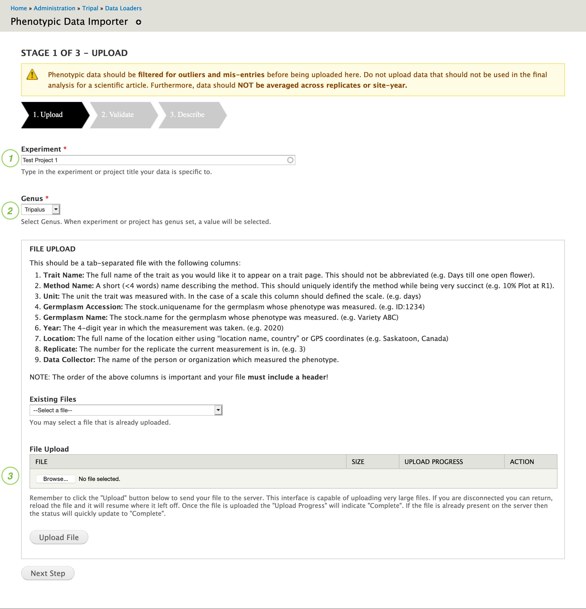
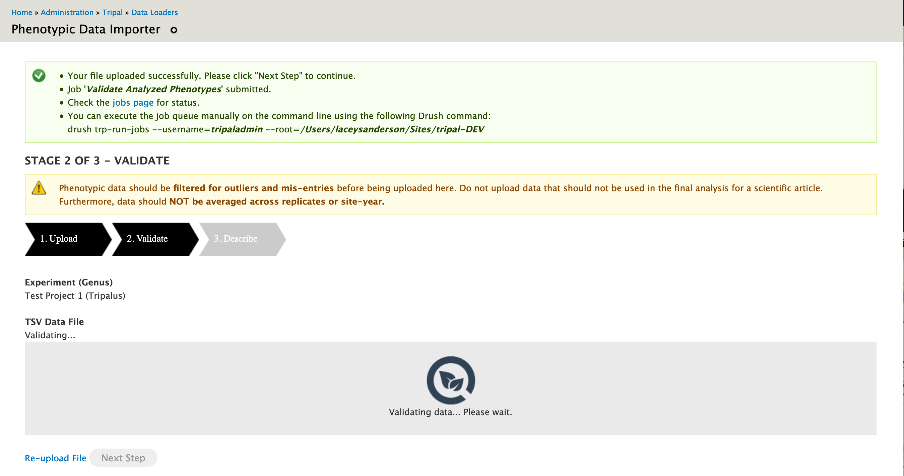
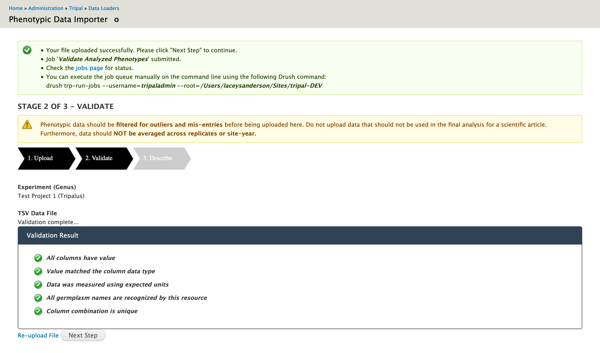
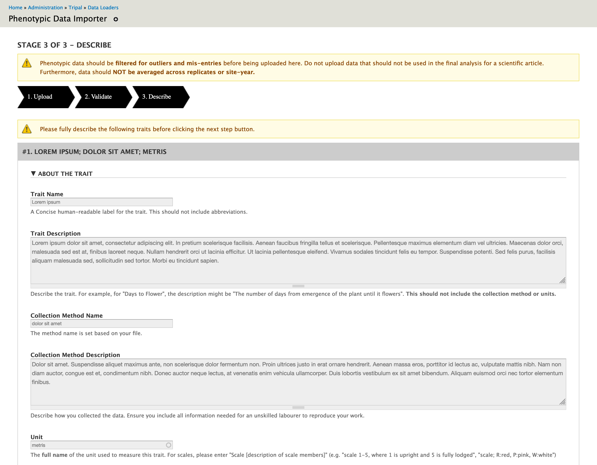
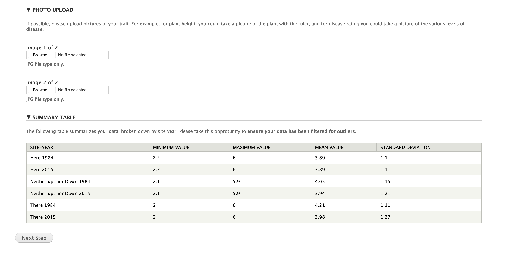

Uploading Phenotypic Data
==========================

Upload File Format
-------------------

The upload data page imports analyzed phenotypic data provided in Tab-Delimited Values (TSV) format. Phenotypic data should be filtered for outliers and mis-entries before being uploaded here. Do not upload data that should not be used in the final analysis for a scientific article. Furthermore, data should NOT be averaged across replicates or site-year.

This file is expected to contain the following columns:

- **Trait Name**: The full name of the trait as you would like it to appear on a trait page. This should not be abbreviated. (e.g. Days till one open flower)
- **Method Name**: A short (<4 words) name describing the method. This should uniquely identify the method while being very succinct. (e.g. 10% Plot at R1)
- **Unit**: The unit the trait was measured with. In the case of a scale this column should defined the scale. (e.g. days)
- **Germplasm Accession**: The stock.uniquename for the germplasm whose phenotype was measured. (e.g. ID:1234)
- **Germplasm Name**: The stock.name for the germplasm whose phenotype was measured. (e.g. Variety ABC)
- **Year**: The 4-digit year in which the measurement was taken. (e.g. 2020)
- **Location**: The full name of the location either using "location name, country" or GPS coordinates (e.g. Saskatoon, Canada)
- **Replicate**: The number for the replicate the current measurement is in. (e.g. 3)
- **Value**: The measured phenotypic value. (e.g. 34)
- **Data Collector**: The name of the person or organization which measured the phenotype.

The following is a short example:

.. code-block:: none

  Trait Name	Method Name	Unit	Germplasm Accession	Germplasm Name	Year	Location	Replicate	Value	Data Collector
  Lorem ipsum	dolor sit amet	metris	ID:1	GERM1	2015	"Neither up, nor Down"	1	5.3	Lacey Sanderson
  Lorem ipsum	dolor sit amet	metris	ID:2	GERM2	2015	"Neither up, nor Down"	1	2.2	Lacey Sanderson
  Lorem ipsum	dolor sit amet	metris	ID:3	GERM3	2015	"Neither up, nor Down"	1	4.9	Lacey Sanderson
  Lorem ipsum	dolor sit amet	metris	ID:1	GERM1	2015	There	1	5.1	Lacey Sanderson
  Lorem ipsum	dolor sit amet	metris	ID:2	GERM2	2015	There	1	3.6	Lacey Sanderson
  Lorem ipsum	dolor sit amet	metris	ID:3	GERM3	2015	There	1	4	Lacey Sanderson
  Lorem ipsum	dolor sit amet	metris	ID:1	GERM1	2015	Here	1	5.1	Lacey Sanderson
  Lorem ipsum	dolor sit amet	metris	ID:2	GERM2	2015	Here	1	3.3	Lacey Sanderson
  Lorem ipsum	dolor sit amet	metris	ID:3	GERM3	2015	Here	1	4.5	Lacey Sanderson

.. note::

  You can see a full example of this file distributed with the module: ``tests/example_files/AnalyzedPhenotypes-TestData-1trait3loc2yr3rep.txt``. The screenshots in this tutorial were taken importing this particular example file.

Stage 1: Upload File
----------------------

The importer is available through the Administrative Toolbar > Tripal > Data Loaders > Phenotypic Data Importer.

1. Enter the name of the experiment your phenotypic data was taken for. The experiment should already exist. If your experiment does not exist, first go to Admin Toolbar > Content > Tripal Content > Add Tripal Content to add a "Research Experiment" describing your experiment.

2. Choose the genus of the organism of the germplasm samples your data was taken on. This system supports data from multiple species but requires each file only contain a single genus. If the genus is not available, contact your administrator to configure ontologies for your genus.

3. Next, under file upload, use the "Browse" button to select the file containing your phenotypic data. Navigate to the file and click open, then click "Upload File".

.. warning::

  The trait, method and unit names in your file will be used in the describe phase but you will be unable to change you. Please ensure the trait name (e.g. Days till Plants have one open flower) is generic to allow data to be combined with the method name (e.g. Days till 10% of plants/plot have one open flower) very specific.

Basic compliance tests at the file level are performed to ensure that requirements outlined are met. For instance, the file must be a valid tab-delimited file following the format outlined above, the genus must be configured for phenotypic data and the experiment must be selected. You will only be notified about errors so you can assume the file validated properly if you see the screen shown in Stage 2.

Stage 2: Validate File
------------------------

In this stage, the file undergoes a data level validation. The entire file is tested against a set of validation rules to ensure that the phenotypic data is compliant. The following is checked:
  - File complies with the format specified above
  - If "Allow new traits..." has been unchecked in configuration, ensure all traits already exist.
  - All columns have a value
  - All metadata columns have the correct data type (e.g. integer for replicates)
  - Each value matches the expected data type, based on the unit
  - All germplasm must already exist in the site and matches to the file must be exact
  - Trait, method, unit, germplasm, location, year, replicate combination must be unique in the file

While validation is ongoing, the user is presented with spinner.

.. warning::
  Administrators are urged to setup the Tripal Daemon since validation occurs during a Tripal Job.

Once validation is complete, you will be shown a list of green checkmarks detailing which criteria passed. If any criteria were not met, a red stop symbol will be shown with helpful information on how to fix the problem.

Stage 3: Describe Traits
--------------------------

Each unique trait in the file is described in this step.

If the trait already exists, you will be shown the trait name, method and unit details existing in the system. This allows you to confirm you have chosen the right values for your file. If the trait does not already exist and the system has been configured to allow entry of traits on upload, you will be asked to describe your trait, data collection method and units.

You also have the ability to upload images describing a trait. For example, an image showing the scale is particularly helpful!

Finally, the data in the file for a given trait is summarized. This can help you pick out problems such as outliers with the data before you upload it. Furthermore, it can be used to confirm the correct file was uploaded.

.. warning::

  Once you click "Import File", the form submits a Tripal job to complete the importing process. The form will reset and the Tripal Job will be completed in the background.
  
