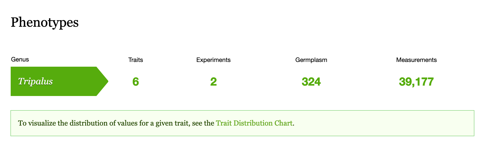
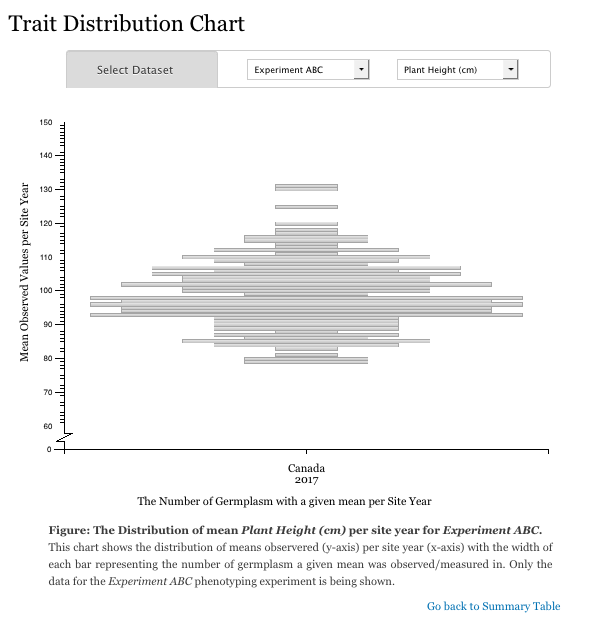

Visualize the data
==================

The data you have loaded is summarized on the phenotypic summary page. The following example summarizes a single experiment where only one trait was measured for 132 germplasm. 

To visualize the distribution of values for a single trait, see the Trait Distribution chart for that trait. This chart can be accessed from the summary page above and will summarize the data for a single trait within a single experiment. Data is averaged across replicates but not across site-years. This allows you to compare the trait distribution between site-years for consistency and/or environmental effect.

