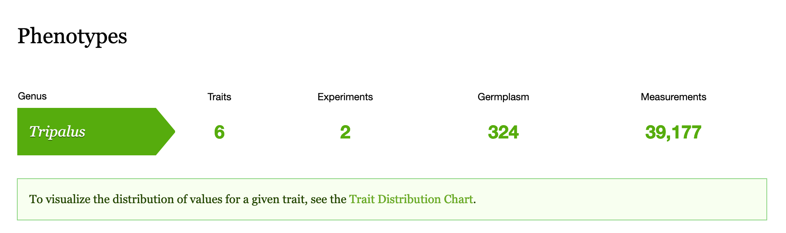

Visualize Phenotypic Data
===========================

The data you have loaded is summarized on the phenotypic summary page. The following example summarizes two experiments where a total of six traits were measured. The number of germplasm represents the unique set assayed among all traits and experiments; it does not imply that any one trait was measured by 324 germplasm although this may be the case. The number of measurements indicates the number of phenotypic data points available.

To visualize the distribution of values for a single trait, see the Trait Distribution chart for that trait. This chart can be accessed from the summary page above and will summarize the data for a single trait within a single experiment. Data is averaged across replicates but not across site-years. This allows you to compare the trait distribution between site-years for consistency and/or environmental effect. For quantitative traits a violin plot is shown and for qualitative traits a multi-bar chart is shown.

.. image:: visualize.2.trait-distribution-chart.png

